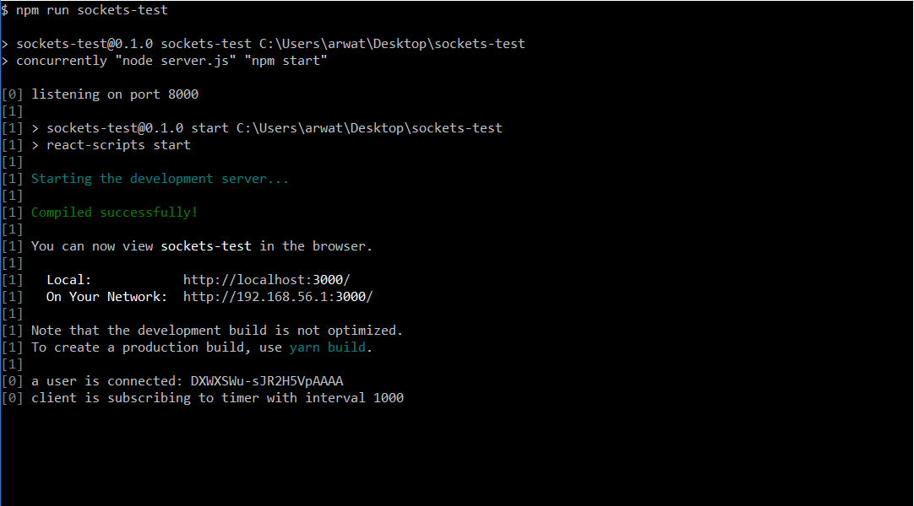
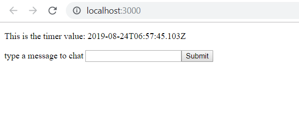

# Sockets With React

This project was created in order to implement and test the Socket.IO node package with a React front-end.

## Instructions

These instructions assume that you have some experience in using the command line interface.

Even if you don't, now is a great time to start learning.

You will also need to have [node](https://nodejs.org/en/download/) installed.

### Installing the Dependencies

To run this application you will have to install the dependencies with the following command,

```
yarn install

// or

yarn
```

Don't have yarn?

you can get it [here!](https://yarnpkg.com/en/)

or you can install the dependencies using [npm](https://www.npmjs.com/get-npm), just make sure to delete the yarn.lock file first.

```
npm install
```

### Running the Application

After installing your dependecies, run the following script

```
npm run sockets-test
```

This script runs the server script and the React script [concurrently](https://www.npmjs.com/package/concurrently) (see what I did there? ;p ).

After running the script you should see something like this,



Shortly afterwards you should the front end components rendered in your default browser of choice,



And that's it!

## How it works

Ther server side script does two things.

It sends the timestamp every second to the front-end, and it listens for any chat messages coming in from the front-end of our application.

When the server recieves a message it sends the message to all users connected to the application.

The message sent contains the id generated by Socket.IO and the chat message entered by the user.

You can test this out locally by opening multiple tabs in your browser and connecting to the application.

### Technology

 - Node.JS
 - Express
 - React
 - Socket.IO